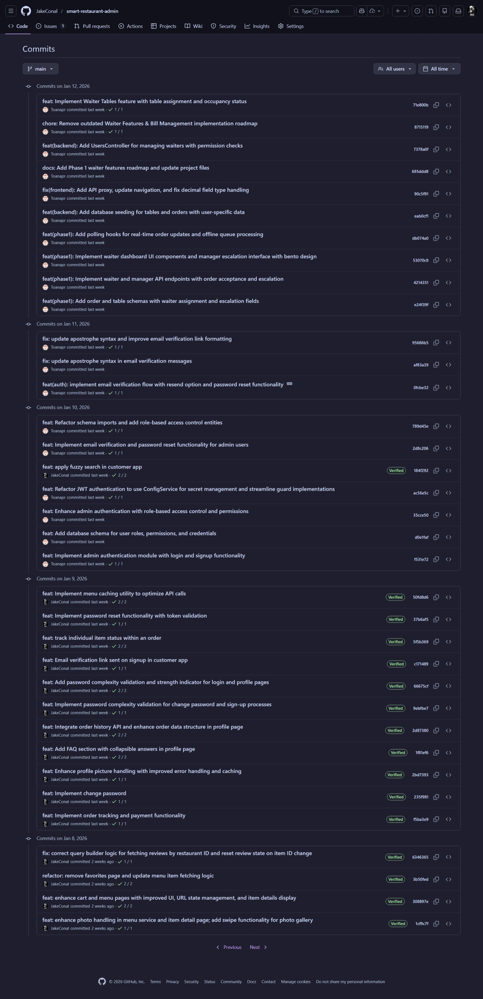
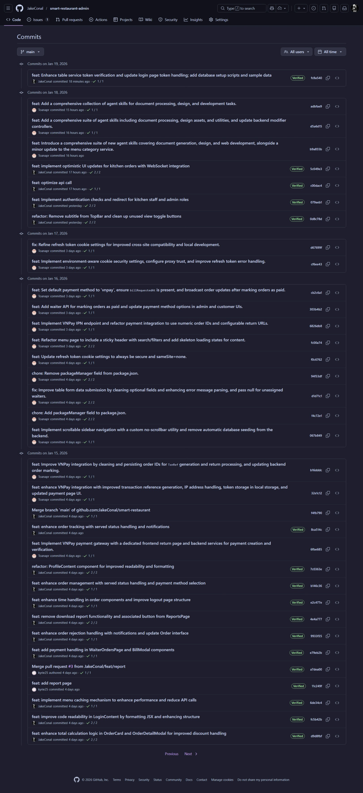
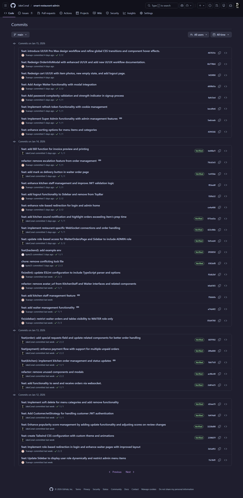
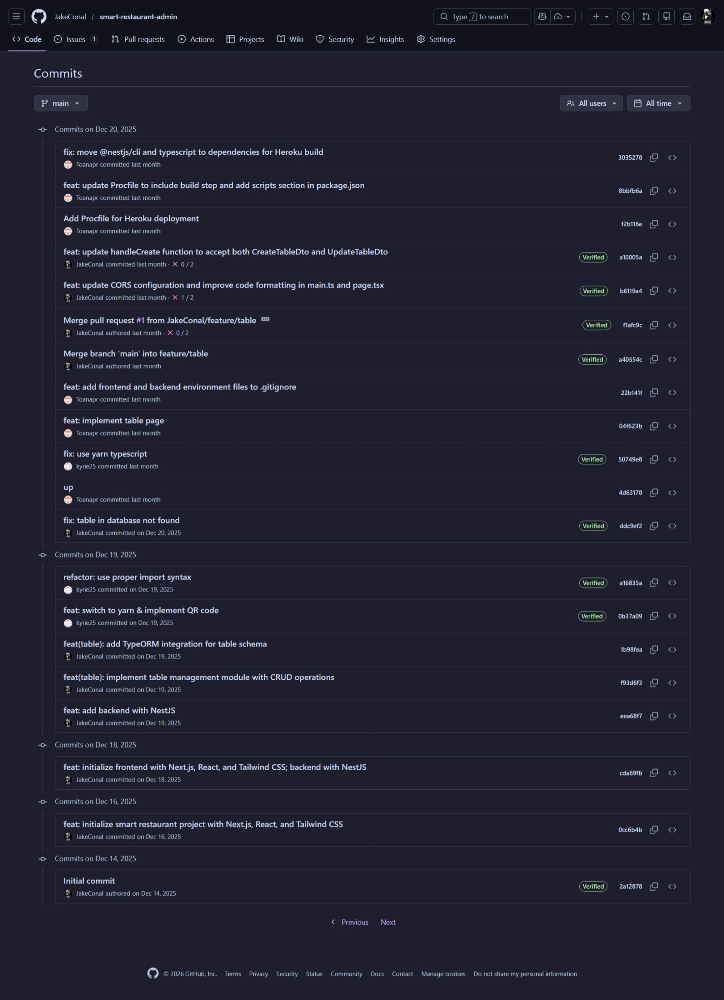
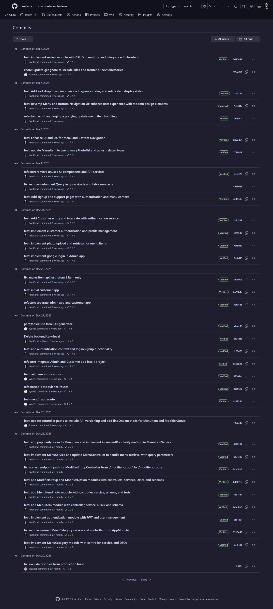

# TEAMWORK REPORT

## Smart Restaurant - QR Menu Ordering System

**Team Members:**

- **Nguyễn Minh Hiếu** (23120124) - Team Lead & Customer App Architect
- **Huỳnh Thái Toàn** (23120175) - System Architect & Payment Specialist
- **Phạm Quốc Nam Anh** (23120111) - Backend Specialist & Reporting

---

## 1. COLLABORATION OVERVIEW

Our team utilized a modern agile workflow to develop the Smart Restaurant system. We collaborated through:

- **Git & GitHub:** Central repository for code management, utilizing feature branching and Pull Requests for code review.
- **Discord:** Constant communication for rapid problem-solving and synchronization.

---

## 2. MEMBER CONTRIBUTIONS & RESPONSIBILITIES

### Contribution Summary

| Member                                                                       | Focus Areas                             | Key Deliverables                                                                 |
| :--------------------------------------------------------------------------- | :-------------------------------------- | :------------------------------------------------------------------------------- |
|  **Nguyễn Minh Hiếu** | Customer Mobile App / Real-time Systems | End-to-end Ordering flow, WebSocket tracking, Fuzzy Search, Client-side Caching. |
|  **Huỳnh Thái Toàn**    | Admin Dashboard / Payment Integration   | Database Schema, RBAC, VNPay Integration, Kitchen Display System (KDS).          |
|  **Phạm Quốc Nam Anh**  | Reports / Backend Infrastructure        | Sales Reporting Engine, QR Generation, Backend modularization.                   |

---

## 3. TECHNICAL COLLABORATION DETAILS

### 3.1 Version Control Strategy

We adopted a **Trunk-Based Development** approach:

- **Single Source of Truth:** The team committed directly to the `main` branch to ensure rapid integration and avoid complex merge conflicts.
- **Experimental Branches:** Short-lived branches were occasionally used to isolate and test advanced or experimental features before integrating them back into the main trunk.
- **Continuous Integration:** By working primarily on `main`, we maintained a high-velocity development cycle with constant visibility into the project's current state.

### 3.2 Feature Integration Workflow

- **Frontend-Backend Sync:** Hiếu and Toàn collaborated closely on the Order API and WebSocket protocols to ensure live updates worked seamlessly across both the Customer and Staff apps.
- **Database Schema Design:** Toàn designed the initial schema, which was then iteratively refined by the whole team as new requirements (like Modifiers and Reports) emerged.
- **Deployment:** The team worked together on the `Procfile` and deployment configurations to ensure the project was stable on public hosting environments.

---

## 4. GIT COMMIT STATISTICS

The following is a summary of our team's activity on the GitHub repository.

### Commit Frequency by Member

- **Nguyễn Minh Hiếu (JakeConal):** ~86 commits
- **Huỳnh Thái Toàn (Toan Huynh):** ~79 commits
- **Phạm Quốc Nam Anh (Nam Anh):** ~12 commits

### Evidence of Collaboration (GitHub Screenshots)

_Page 1_

_Page 2_

_Page 3_

_Page 4_

_Page 5_

---

**Date:** January 19, 2026
**Signed:**
_Nguyễn Minh Hiếu (Lead)_
_Huỳnh Thái Toàn_
_Phạm Quốc Nam Anh_
